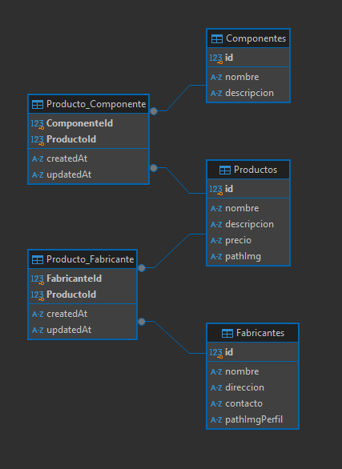

## Propósito general
El presente sistema está diseñado para gestionar productos y sus relaciones en una base de datos, facilitando el acceso y la manipulación de datos a través de una API REST.

## Tecnologías Implementadas
1. **Node.js**: Entorno de ejecución JavaScript en el servidor.
2. **Express**: Framework web para Node.js.
3. **Sequelize**: ORM (Object-Relational Mapping) para interactuar con bases de datos SQL.
4. **SQLite** (para desarrollo) y **MySQL** (para pruebas y producción): Sistemas de gestión de bases de datos utilizados para almacenar la información.
5. **Joi**: Librería utilizada para validación de datos.

## Información para Usuarios 

1. **Instalación y Configuración** (Se requiere tener Node.js instalado en el servidor):
   - **Clonar el Repositorio**:   `git clone https://github.com/EP-2024C2/tp-ntom-delfondo-inc.git`
   - **Instalación de Dependencias**: `npm install`
   - **Iniciar aplicación (producción)**: `npm start`
   - **Iniciar aplicación (desarrolladores)**: `npm run dev`

2. **Configuración de la Base de Datos**:
   - Este sistema utiliza **MySQL**.
   - Si se deseara utilizar otra base de datos, debería realizarse una modificación en el archivo `src/config/config.json`
     
      **Uso de PostgreSQL con Docker (Desarrollo)**
   2.1. Ubicarse en el arhivo `docker-compose.yml` en la raíz del  proyecto. 
   2.2. Abrir una terminal y ejecutar Docker Compose: `docker-compose up -d` 
   Aclaración: `up`: Levanta los servicios definidos en el archivo y
   `-d`: Ejecuta los contenedores en segundo plano (detached).
   2.3. Iniciar servidor en modo desarrollo. 

3. **Uso de la API**:
   - Solicitudes HTTP a las rutas definidas para productos, fabricantes y componentes:

|Verbo|Recurso|Status code|Descripción|
|-----|-------|-----------|-----------|
| GET   | /productos | 200 | Obtener todos los productos |
| GET   | /productos/:id | 200, 404 | Obtener un producto en particular |
| POST  | /productos | 201, 400 | Crear un producto |
| PUT   | /productos/:id | 200, 404 | Modificar los datos de un producto en particular |
| DELETE| /productos/:id | 200, 404, 500 | Borrar un producto en particular |
| POST  | /productos/:id/fabricantes | 201, 404, 400 | Crear la asociación de producto con 1 o N fabricantes |
| GET   | /productos/:id/fabricantes | 200, 404 | Obtener todos los fabricantes de un producto |
| POST  | /productos/:id/componentes | 201, 404, 400 | Crear la asociación de producto con 1 o N componentes |
| GET   | /productos/:id/componentes | 200, 404 | Obtener todos los componentes de un producto |
| GET   | /fabricantes | 200 | Obtener todos los fabricantes |
| GET   | /fabricantes/:id | 200, 404 | Obtener un fabricante en particular |
| POST  | /fabricantes | 201, 400 | Crear un fabricante |
| PUT   | /fabricantes/:id | 200, 404 | Modificar los datos de un fabricante en particular |
| DELETE| /fabricantes/:id | 200, 404, 500 | Borrar un fabricante en particular |
| GET   | /fabricantes/:id/productos | 200, 404 | Obtener todos los productos de un fabricante |
| GET   | /componentes | 200 | Obtener todos los componentes |
| GET   | /componentes/:id | 200, 404 | Obtener un componente en particular |
| POST  | /componentes | 201, 400 | Crear un componente |
| PUT   | /componentes/:id | 200, 404 | Modificar los datos de un componente en particular |
| DELETE| /componentes/:id | 200, 404, 500 | Borrar un componente en particular |
| GET   | /componentes/:id/productos | 200, 404 | Obtener todos los productos de un componente |

## Modelo relacional del sistema 

